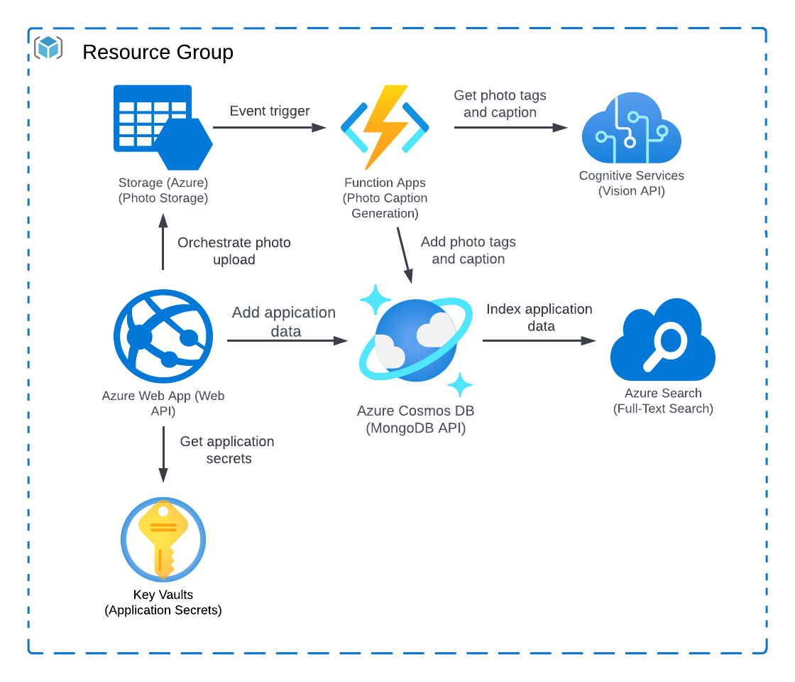

# visuai

AI-based photo-sharing service that helps discover ideas such as recepies, home deco, interior design, style inspiration, fashion, places, events, health etc. by sharing photos.

The project addresses the design choices of developing applications:

* Project structure and organization.
* Practical code patterns for creating robust and maintainable programs.

Development practices is based on guiding principles of well written Go code.

* Clarity
* Simplicity
* Correctness
* Productivity

### Table of Contents
- [visuai](#visuai)
    - [Table of Contents](#table-of-contents)
  - [Features](#features)
  - [Architecture](#architecture)
    - [Architecture components](#architecture-components)
  - [Platform & Technology used](#platform--technology-used)
  - [How to install](#how-to-install)
    - [Using Git (recommended)](#using-git-recommended)
    - [Using Makefile](#using-makefile)
  - [Displaying help information](#displaying-help-information)
  - [Quality Controlling Code](#quality-controlling-code)
  - [Profiling Test Coverage](#profiling-test-coverage)
  - [Vendoring New Dependencies](#vendoring-new-dependencies)
  - [Build](#build)
  - [Author :black_nib:](#author-black_nib)
  - [License :lock:](#license-lock)
  - [Text](#text)
  - [Code](#code)

## Features

1. AI photo description generation; automates photo description generation based on the activities and objects detected on the photo, this description can be used by screen readers to improve the experience of users that relly on screen readers. ie. visually impaired and blind users.
2. AI photo auto-tagging based on the objects, living beings, scenery or actions found in the photos to aid classification.
3. Photo geotagging to associate photos with a given geographical location.
4. Cognitive search to enable users to expressively search for content and get results based on the semantic meaning of the search phrase.
5. Photo management to enable users to upload, delete, share etc. photos.
6. Analytics; track user interaction from analytics and insights.

## Architecture

<p>
  
</p>

### Architecture components

1. Computer Vision API is part of the Cognitive Services suite and is used to retrieve information about each image.
2. Azure Functions provides the back-end API for the web application. This platform also provides event processing for uploaded images.
3. Azure Event Grid triggers an event when a new image is uploaded to blob storage. The image is then processed with Azure functions.
4. Azure Blob Storage stores all of the image files that are uploaded into the web application, as well any static files that the web application consumes.
5. Azure Cosmos DB stores metadata about each image that is uploaded, including the results of the processing from Computer Vision API.
6. Azure Key Vault
7. Azure Cognitive Search
8. Azure Web APP Service

## Platform & Technology used

1. Cloud Platform: Microsoft Azure Cloud
2. Development Language: GoLang & Python
3. Full-Text Search: Azure Cognitive Search
4. Secret Management: Azure Key Vault
5. Authentication & Authorisation: AUTHO (auth provider)
6. Photo/Blob Storage: Azure Blob Store
7. Web Deployment and Management: Azure Web APP Service
8. Photo tagging & captioning: Azure Computer Vision API
9. Data warehousing: Azure Data lake

## How to install

### Using Git (recommended)

Clone the project from github.

```
git clone https://github.com/evansopilo/visuai.git 
cd visuai
```

Using manual download ZIP

1. Download repository
2. Uncompress to your desired directory

### Using Makefile

Use the GNU make utility and makefiles to help automate common tasks in out project, such as creating and executing database migrations.

## Displaying help information

Execute the `help` target, you should get a response which lists all the available targets and the corresponding help text.

```
Usage:
  help        print this help message
  run/cmd     run the cmd/ application
  audit       tidy and vendor dependencies and format, vet and test all code
  coverage    go test coverage
  vendor      tidy and vendor dependencies
  build/cmd   build the cmd/ application
```

## Quality Controlling Code

The audit rule will:

* prune dependencies
* verify module dependencies
* format all .go files, according to the Go standard
* vet code; runs a variety of analyzers which carry out static analysis
* staticcheck; carry out some additional static analysis checks
* test

To run these checks before you commit any code changes into your version control system or build any binaries.

```
$ make audit
```

## Profiling Test Coverage

A feature of the `go test` tool is the metrics and visualizations that it provides for test coverage.

```
$ make coverage
Running test coverage ...
go test -cover ./...
?       github.com/evansopilo/visuai/cmd        [no test files]
?       github.com/evansopilo/visuai/pkg/blob   [no test files]
?       github.com/evansopilo/visuai/pkg/data   [no test files]
?       github.com/evansopilo/visuai/pkg/log    [no test files]
?       github.com/evansopilo/visuai/pkg/secret [no test files]
go test -covermode=count -coverprofile=/tmp/profile.out ./...
?       github.com/evansopilo/visuai/cmd        [no test files]
?       github.com/evansopilo/visuai/pkg/blob   [no test files]
?       github.com/evansopilo/visuai/pkg/data   [no test files]
?       github.com/evansopilo/visuai/pkg/log    [no test files]
?       github.com/evansopilo/visuai/pkg/secret [no test files]
go tool cover -html=/tmp/profile.out
```

This will open a browser window containing a navigable and highlighted representation of your code.

## Vendoring New Dependencies

**Note**: It's important to point out that there's no easy way to verify that the checksums of the vendored dependencies match the checksums in the `go.sum` file.

To mitigate that, it's a good idea to run both `go mod verify` and `go mod vendor` regularly. Using `go mod verify` will verify that the dependencies in your module cache match the `go.sum` file, and `go mod vendor` will copy those same dependencies from the module cache into your `vendor` directory.

```
# vendor rule execute both `go mod verify` and `go mod vendor` commands.
$ make vendor
```

## Build

Build and run executable binaries for our applications.

Go supports **cross-compilation** , so you can generate a binary suitable for use on a different machine.

Let's create two binaries — one for use on your local machine, and another for deploying to the Ubuntu Linux server.

To build binaries, you need to execute:

```
$ make build/cmd
```

## Author :black_nib:

- **Evans M Opilo** - [evansopilo](https://github.com/evansopilo)

## License :lock:

This repository contains a variety of content; some developed by Evans Opilo, and some from third-parties. The third-party content is distributed under the license provided by those parties.

I am providing code and resources in this repository to you under an open source license. Because this is my personal repository, the license you receive to my code and resources is from me and not my employer.

The content developed by Evans Opilo is distributed under the following license:

## Text

The text content is released under the CC-BY-NC-ND license. Read more at Creative Commons.

## Code

The code in this repository is released under the MIT license, see the [LICENSE](./LICENSE) file for details.
